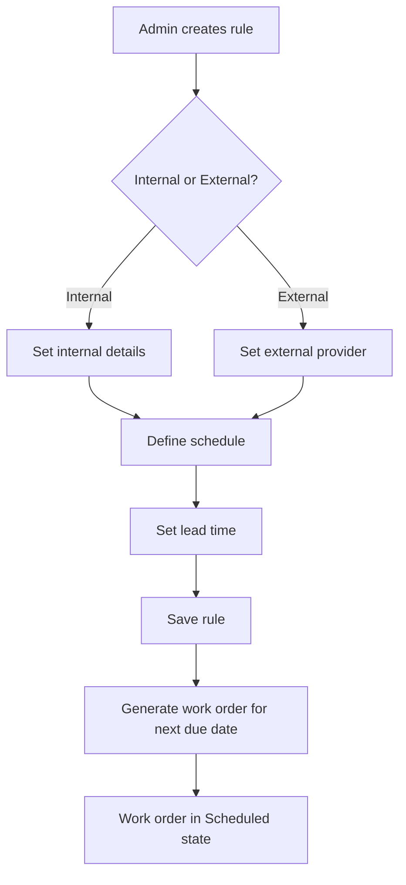
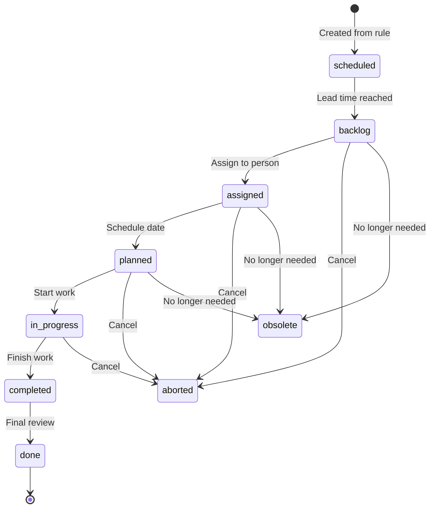
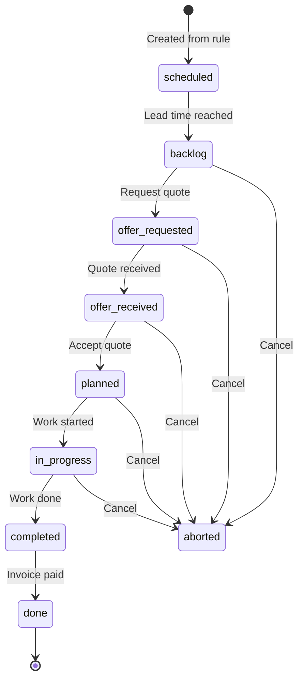
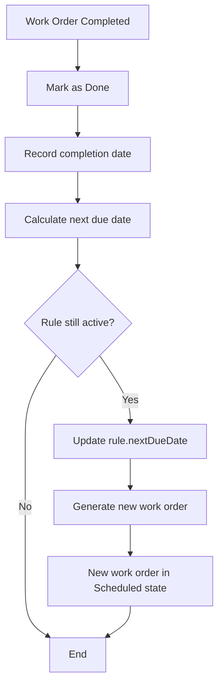
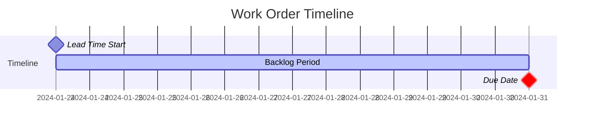
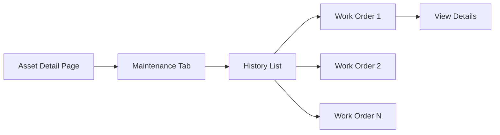
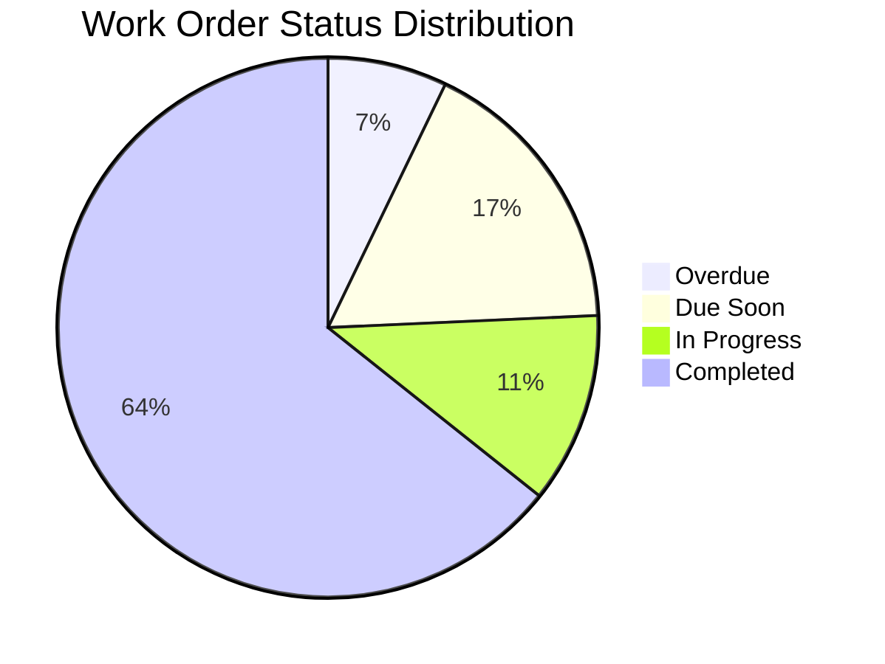

# Maintenance Workflow Documentation

This document describes the expected maintenance workflow for the ChurchTools Inventory Extension.

## Overview

The maintenance system manages preventive maintenance schedules for assets. It consists of:

1. **Maintenance Rules** - Define recurring maintenance schedules
2. **Work Orders** - Individual maintenance tasks generated from rules
3. **Asset Maintenance History** - Record of completed maintenance

## 1. Rule Creation Workflow



### Rule Fields

| Field | Description |
|-------|-------------|
| Name | Descriptive name for the maintenance task |
| Asset | The asset requiring maintenance |
| Type | Internal or External |
| Interval | Frequency (days, weeks, months, years) |
| Lead Time | Days before due date to create work order |
| Instructions | Step-by-step maintenance instructions |
| External Provider | (External only) Service provider name |
| Estimated Cost | Expected cost per occurrence |

## 2. Work Order Lifecycle

### 2.1 Internal Work Orders



### 2.2 External Work Orders



### State Descriptions

| State | Description | Actions Available |
|-------|-------------|-------------------|
| scheduled | Future work order, not yet actionable | View only |
| backlog | Ready to be worked on | Assign, Request Offer, Abort |
| assigned | Assigned to a person | Plan, Abort |
| planned | Date scheduled | Start, Abort |
| offer-requested | Quote requested from vendor | Receive Offer, Abort |
| offer-received | Quote received | Plan, Abort |
| in-progress | Work is being performed | Complete, Abort |
| completed | Work finished, pending review | Done, Abort |
| done | Fully completed | (Terminal) |
| aborted | Cancelled | (Terminal) |
| obsolete | No longer relevant | (Terminal) |

## 3. Completion Flow



### Next Due Date Calculation

```
nextDueDate = previousDueDate + interval

Examples:
- Monthly rule due Jan 15 → Next due Feb 15
- 90-day rule due Jan 1 → Next due Apr 1
- Annual rule due 2024-03-01 → Next due 2025-03-01
```

## 4. Lead Time Behavior

Lead time determines when a scheduled work order moves to backlog:



- **Example**: 7-day lead time, due Jan 31
- Work order moves from `scheduled` → `backlog` on Jan 24
- This gives 7 days to complete before due date

## 5. Asset Maintenance History

Each completed work order is recorded in the asset's maintenance history:



### History Record Fields

| Field | Description |
|-------|-------------|
| Date Completed | When maintenance was done |
| Work Order # | Reference to work order |
| Type | Internal/External |
| Performed By | Person or provider |
| Cost | Actual cost incurred |
| Notes | Completion notes |

## 6. Dashboard Metrics

The maintenance dashboard should display:

1. **Overdue Count** - Work orders past due date but not completed
2. **Due This Week** - Work orders due in next 7 days
3. **In Progress** - Work orders currently being worked
4. **Completed This Month** - Successfully finished work orders
5. **Compliance Rate** - % of work orders completed on or before due date



## 7. Common Scenarios

### Scenario A: Create and Complete Internal Maintenance

1. Admin creates rule: "Monthly HVAC Filter Change" for Asset "AC Unit 1"
2. Rule generates work order due Jan 31 with 7-day lead time
3. On Jan 24, work order moves to backlog
4. Facility manager assigns to technician
5. Technician schedules for Jan 28
6. Technician starts work on Jan 28
7. Technician completes work, marks as completed
8. Manager reviews and marks as done
9. Rule updates nextDueDate to Feb 28
10. New work order generated, scheduled for Feb 28

### Scenario B: External Maintenance with Quote

1. Admin creates rule: "Annual Fire Extinguisher Inspection" (external)
2. Work order moves to backlog 30 days before due
3. Admin requests quote from fire safety company
4. Company sends quote
5. Admin receives and accepts quote
6. Admin schedules inspection date
7. Company performs inspection
8. Admin marks as completed
9. Admin pays invoice, marks as done
10. New work order generated for next year

### Scenario C: Overdue Work Order

1. Work order due Jan 15 not addressed
2. Dashboard shows 1 overdue work order
3. Manager receives notification
4. Work completed Jan 20 (5 days late)
5. Compliance rate decreases
6. Report shows "5 days overdue" in completion report

## 8. Error Handling

### Invalid Transitions

The system prevents invalid state transitions:

- Cannot skip states (e.g., backlog → in-progress without assigning)
- Cannot transition from terminal states (done, aborted, obsolete)
- External work orders must go through offer flow

### Missing Data

Work orders require certain data at certain states:

| Transition | Required Data |
|------------|---------------|
| → assigned | Assignee |
| → planned | Planned date |
| → offer-received | Quote details |
| → completed | Completion notes |

## 9. Integration Points

### Calendar Integration

Work orders can be synced to calendar:
- Planned work orders show on their scheduled date
- Due dates show as reminders

### Notifications

System sends notifications for:
- New work orders entering backlog
- Overdue work orders
- Work order assignments
- Completion reminders

### Asset Status

Completing maintenance can optionally update asset status:
- If asset was "in-maintenance" → returns to "available"
- Maintenance record added to asset history
