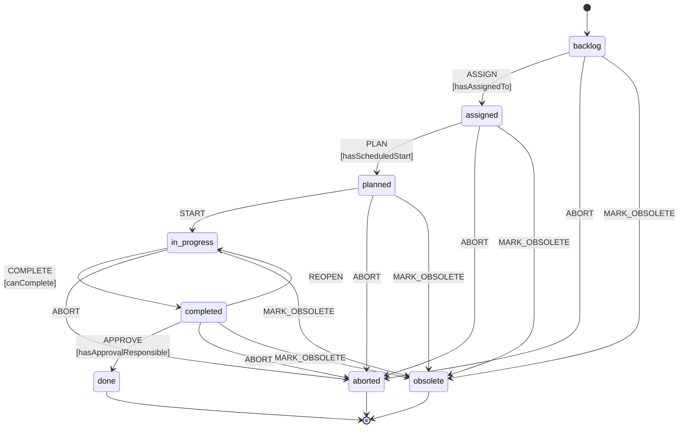
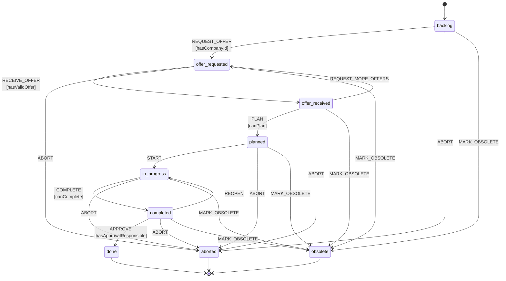

# Work Order State Machine

This document describes the XState-based state machines for work order management.

## Implementation Files

- `src/services/machines/InternalWorkOrderMachine.ts` - Internal work orders
- `src/services/machines/ExternalWorkOrderMachine.ts` - External work orders
- `src/services/machines/WorkOrderMachineAdapter.ts` - Adapter for simplified API

## Internal Work Order State Machine



### States

| State | Description | Entry Conditions |
|-------|-------------|------------------|
| backlog | Initial state, ready for assignment | Work order created |
| assigned | Assigned to a person | ASSIGN event with valid assignedTo |
| planned | Date scheduled | PLAN event with valid scheduledStart |
| in-progress | Work being performed | START event |
| completed | Work finished | COMPLETE event with all line items done |
| done | Fully approved (terminal) | APPROVE event with approvalResponsibleId |
| aborted | Cancelled (terminal) | ABORT event from any non-terminal state |
| obsolete | No longer relevant (terminal) | MARK_OBSOLETE event from any non-terminal state |

### Guards

| Guard | Condition |
|-------|-----------|
| hasAssignedTo | event.assignedTo is non-empty |
| hasScheduledStart | event.scheduledStart is non-empty |
| canComplete | event.actualEnd is non-empty AND all lineItems have completionStatus='completed' |
| hasApprovalResponsible | context.workOrder.approvalResponsibleId is set |

### Events

| Event | Payload | Target State |
|-------|---------|--------------|
| ASSIGN | { assignedTo: UUID } | assigned |
| PLAN | { scheduledStart: string } | planned |
| START | - | in-progress |
| COMPLETE | { actualEnd: string } | completed |
| APPROVE | - | done |
| ABORT | - | aborted |
| MARK_OBSOLETE | - | obsolete |
| REOPEN | - | in-progress |

## External Work Order State Machine



### States

| State | Description | Entry Conditions |
|-------|-------------|------------------|
| backlog | Initial state, ready for quote request | Work order created |
| offer-requested | Quote requested from vendor | REQUEST_OFFER with valid companyId |
| offer-received | At least one quote received | RECEIVE_OFFER with valid offer |
| planned | Date scheduled with vendor | PLAN with scheduledStart and offers |
| in-progress | Vendor performing work | START event |
| completed | Work finished by vendor | COMPLETE event with all line items done |
| done | Invoice paid, fully closed (terminal) | APPROVE event with approvalResponsibleId |
| aborted | Cancelled (terminal) | ABORT event from any non-terminal state |
| obsolete | No longer relevant (terminal) | MARK_OBSOLETE event from any non-terminal state |

### Guards

| Guard | Condition |
|-------|-----------|
| hasCompanyId | event.companyId is non-empty |
| hasValidOffer | offer.companyId is non-empty AND offer.amount > 0 |
| canPlan | event.scheduledStart is non-empty AND offers.length >= 1 |
| canComplete | event.actualEnd is non-empty AND all lineItems have completionStatus='completed' |
| hasApprovalResponsible | context.workOrder.approvalResponsibleId is set |

### Events

| Event | Payload | Target State |
|-------|---------|--------------|
| REQUEST_OFFER | { companyId: UUID } | offer-requested |
| RECEIVE_OFFER | { offer: WorkOrderOffer } | offer-received |
| PLAN | { scheduledStart: string } | planned |
| START | - | in-progress |
| COMPLETE | { actualEnd: string } | completed |
| APPROVE | - | done |
| ABORT | - | aborted |
| MARK_OBSOLETE | - | obsolete |
| REQUEST_MORE_OFFERS | - | offer-requested |
| REOPEN | - | in-progress |

## Context

Both machines use a similar context structure:

```typescript
interface WorkOrderContext {
  workOrder: Partial<WorkOrder>;
}
```

The `WorkOrder` type includes:
- `id`, `workOrderNumber` - Identifiers
- `state` - Current state
- `assignedTo` - Assigned user (internal)
- `companyId` - External company (external)
- `scheduledStart`, `scheduledEnd` - Planned dates
- `actualStart`, `actualEnd` - Actual dates
- `offers` - Array of quotes (external only)
- `lineItems` - Tasks within the work order
- `history` - State change history
- `approvalResponsibleId` - Final approver

## Actions

All transitions trigger the `recordStateChange` action which:
1. Updates `workOrder.state` to the new state
2. Appends a `WorkOrderHistoryEntry` to `workOrder.history`

Additional actions per event:
- `ASSIGN`: Sets `workOrder.assignedTo`
- `REQUEST_OFFER`: Sets `workOrder.companyId`
- `RECEIVE_OFFER`: Appends to `workOrder.offers`
- `PLAN`: Sets `workOrder.scheduledStart`
- `START`: Sets `workOrder.actualStart` to now
- `COMPLETE`: Sets `workOrder.actualEnd`
- `REOPEN`: Clears `workOrder.actualEnd`

## Usage

### Using the Adapter

```typescript
import { createInternalMachine, createExternalMachine } from './WorkOrderMachineAdapter';

// Internal work order
const internalMachine = createInternalMachine();
const result = internalMachine.transition('backlog', { type: 'ASSIGN', assignedTo: 'user-123' }, { workOrder: {} });

console.log(result.changed); // true
console.log(result.value);   // 'assigned'
console.log(result.context); // { workOrder: { assignedTo: 'user-123', ... } }

// External work order
const externalMachine = createExternalMachine();
const extResult = externalMachine.transition('backlog', { type: 'REQUEST_OFFER', companyId: 'company-456' }, { workOrder: {} });
```

### Using XState Actors (Recommended for Production)

```typescript
import { createActor } from 'xstate';
import { internalWorkOrderMachine } from './InternalWorkOrderMachine';

const actor = createActor(internalWorkOrderMachine, {
  input: { workOrder: existingWorkOrder },
});

actor.subscribe((snapshot) => {
  console.log('State:', snapshot.value);
  console.log('Context:', snapshot.context);
});

actor.start();
actor.send({ type: 'ASSIGN', assignedTo: 'user-123' });
```

## Testing

Tests are located in:
- `src/tests/services/WorkOrderStateMachine.test.ts`
- `src/tests/services/InternalWorkOrderMachine.test.ts`
- `src/tests/services/ExternalWorkOrderMachine.test.ts`

Run tests:
```bash
npm test -- --run src/tests/services/WorkOrderStateMachine
```

## UI Integration

The `WorkOrderStateTransition.tsx` component provides UI buttons for valid transitions:

```tsx
<WorkOrderStateTransition
  workOrder={workOrder}
  onTransition={handleTransition}
/>
```

The component renders appropriate action buttons based on current state and work order type (internal/external).
